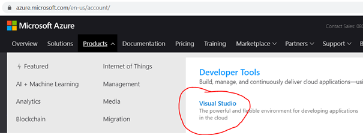

# Procédure d'installation des outils du cours

# Programmation C# base et C# avancé

## Profil d'étudiants

### AA : Programmation orientée objet Windows- C#

B2 : informatique de gestion ou systèmes (toutes finalités)

B3 : bachelier en sciences de l’ingénieur industriel (finalité informatique)

### AA : Programmation Microsoft .NET – C#

B3 : informatique de gestion ou systèmes (toutes finalités)

## Installation

Dans le cadre des différents cours mentionnés ci-dessus, vous aurez à utiliser le logiciel **Microsoft Visual Studio**. Vous trouverez ci-dessous différentes méthodes de téléchargement/installation du logiciel. Il est vivement conseillé que vous le fassiez à domicile. En effet, ce logiciel nécessite le téléchargement de plusieurs GB et l’installation n’est pas instantanée. 

Choisissez tout de suite de travailler en **ANGLAIS** et donc utilisez le site ci-dessous pour installer la bonne version de vos logiciels.

https://azureforeducation.microsoft.com/en-us/Institutions 

Connectez-vous sur cette plateforme avec votre compte ...@student.hepl.be.

Dans l’onglet « Products », choisir « Developer Tools », sélectionnez Visual Studio

Appuyez sur le Bouton « Download Visual Studio ».

Choisir d’installer Visual Studio Community 2019. Après le démarrage de l’installation, choisir les packages suivants (installez directement les packages utiles pour le cours "avancé", ce sera ça de gagné pour quand vous serez en B3) :

Dans l’onglet « charge de travail »

- Développement web et ASP .NET (nécessaire pour le cours "avancé")
- Développement .NET Desktop (nécessaire pour les cours "base" et "avancé")
- Stockage et traitement des données (nécessaire pour le cours "avancé")

Dans l’onglet « Modules linguistique »

- Ajouter l’anglais

Personnellement j’ai ajouté le module « développement de jeux avec Unity ». Dans cette configuration, 9.19 GB sont nécessaires pour l’installation.

Après avoir installé l’application (éventuellement en français), démarrez-là. Cela prend un peu plus de temps la première fois. Utilisez le menu Outils->Options pour accéder aux options. Dans Environnement -> Paramètre internationaux : Choisir « English ».

Redémarrer Visual Studio pour bénéficier des nouveaux paramètres.

Installez l’extension GitHub pour pouvoir gérer les versions de votre code source.

https://marketplace.visualstudio.com/items?itemName=GitHub.GitHubExtensionforVisualStudio

